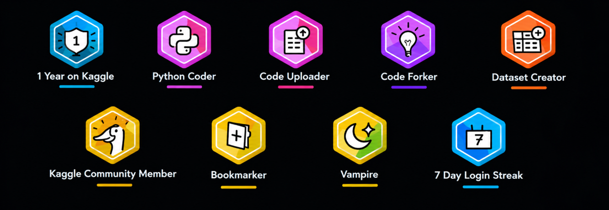

<h1 align="center">Hi 👋, I'm <b>Amishi Jain</b></h1>

<h3 align="center">🚀 AI | ML | Full Stack Developer | Build for Real Impact</h3>

  

---

## 🧠 About Me
- 🎓 B.Tech CSE @ UPES 
- 🤖 Exploring **Machine Learning, NLP, Backend Systems**
- 💡 Building scalable real-world solutions

---
## 📊 GitHub Stats

  <table>
    <tr>
      <td align="center">
        
      </td>
      <td align="center">
        
      </td>
    </tr>
  </table>

## 🔥 Streak Stats

  

---

## 📈 Activity Graph

  

---

## 🚀 Featured Projects

- 🌾 **VAISHVIK** – AI-powered smart agriculture system  
- 📄 **Research Paper Summarizer** – NLP-based system  
- ⚙️ **Emple Backend** – Node.js + Express APIs  
- 🤖 AI Chatbot (Telegram + n8n + GPT)

---

## 🛠️ Tech Stack

  

---

## 🏆 Achievements

  

### 🧌  Kaggle Badges

  

---

## 🌐 Connect With Me

  

  

## 💬 Quote

> “Building solutions that matter, not just code that runs.”
---

## ✨ Thanks for visiting!

  

